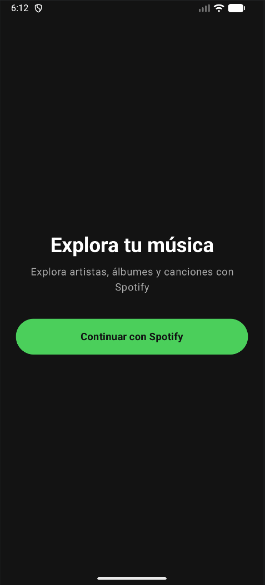
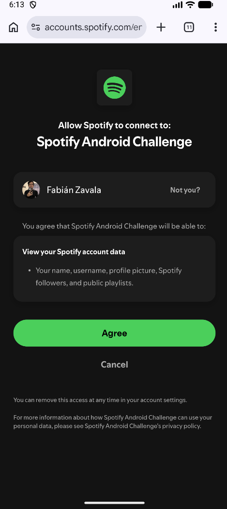
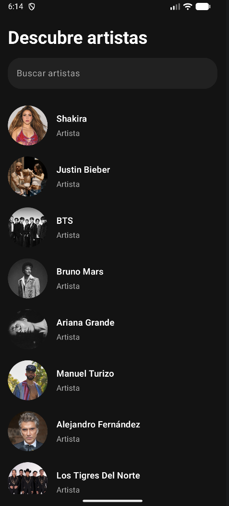
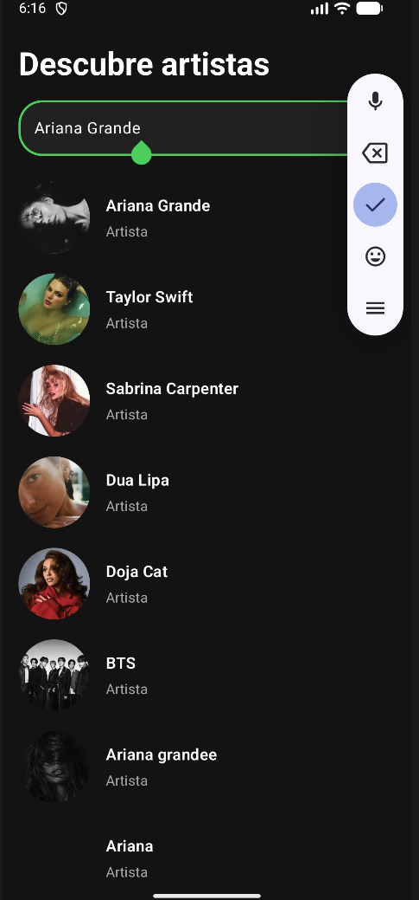
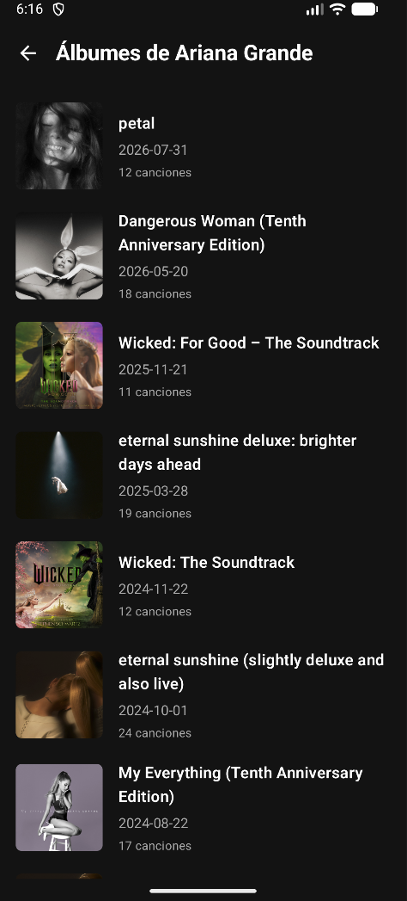

# Spotify Android Challenge

Aplicación Android desarrollada como parte de una prueba técnica para la posición de **Senior Android Developer**.

La aplicación permite autenticarse con Spotify y explorar artistas, consultar sus álbumes y visualizar las canciones de cada álbum utilizando **Spotify Web API**.

El proyecto fue desarrollado con **Kotlin, Jetpack Compose, MVVM, Clean Architecture, Hilt, Retrofit, Coroutines y Paging 3**.

---

<h2>Capturas de pantalla</h2>

<table>
  <tr>
    <th>Inicio de sesión</th>
    <th>Autenticación con Spotify</th>
  </tr>
  <tr>
    <td></td>
    <td></td>
  </tr>
</table>

<table>
  <tr>
    <th>Explorar artistas</th>
    <th>Búsqueda de artistas</th>
  </tr>
  <tr>
    <td></td>
    <td></td>
  </tr>
</table>

<table>
  <tr>
    <th>Álbumes del artista</th>
    <th>Canciones del álbum</th>
  </tr>
  <tr>
    <td></td>
    <td></td>
  </tr>
</table>

---

## Funcionalidades

La aplicación incluye las siguientes funcionalidades:

- Autenticación con Spotify mediante Authorization Code with PKCE.
- Exploración de artistas.
- Búsqueda de artistas.
- Paginación de artistas.
- Consulta de álbumes por artista.
- Paginación de álbumes.
- Consulta de canciones por álbum.
- Paginación de canciones.
- Estados de carga y error.
- Opción para reintentar peticiones que hayan fallado.
- Interfaz oscura inspirada en Spotify.
- Pruebas unitarias.
- Pruebas de UI con Jetpack Compose.

---

## Arquitectura

El proyecto utiliza **MVVM junto con Clean Architecture**.

La aplicación está dividida principalmente en tres capas:

```text
Presentation
     ↓
   Domain
     ↓
    Data
```

### Presentation

Responsable de mostrar la información y gestionar la interacción del usuario.

Contiene:

- Pantallas desarrolladas con Jetpack Compose.
- ViewModels.
- Componentes reutilizables de UI.
- Navegación.
- PagingSources.

### Domain

Contiene la lógica y los modelos principales del dominio.

Incluye:

- Modelos de dominio.
- Interfaces de repositorios.
- Casos de uso.

Esta capa no conoce los detalles de Retrofit ni de la implementación de la interfaz de usuario.

### Data

Responsable de obtener y transformar la información proveniente de Spotify.

Incluye:

- Definiciones de API con Retrofit.
- Autenticación con Spotify.
- DTOs.
- Mappers.
- Implementaciones de repositorios.

---

## Estructura del proyecto

```text
com.fabianzavala.spotifyandroidchallenge
│
├── data
│   ├── mapper
│   ├── remote
│   │   ├── api
│   │   ├── auth
│   │   └── dto
│   └── repository
│
├── di
│
├── domain
│   ├── model
│   ├── repository
│   └── usecase
│
└── presentation
    ├── albums
    ├── artists
    ├── auth
    ├── components
    ├── navigation
    └── tracks
```

---

## Flujo de datos

La información sigue el siguiente flujo dentro de la aplicación:

```text
Spotify Web API
       ↓
    Retrofit
       ↓
      DTO
       ↓
     Mapper
       ↓
Repository Implementation
       ↓
Repository Interface
       ↓
     UseCase
       ↓
    ViewModel
       ↓
Paging / StateFlow
       ↓
Jetpack Compose UI
```

Esta separación permite mantener independientes la interfaz de usuario, la lógica de dominio y la implementación de acceso a datos.

---

## Tecnologías utilizadas

- **Kotlin**
- **Jetpack Compose**
- **Material 3**
- **MVVM**
- **Clean Architecture**
- **Coroutines**
- **Flow / StateFlow**
- **Retrofit**
- **Gson**
- **OkHttp**
- **Hilt**
- **KSP**
- **Navigation Compose**
- **Paging 3**
- **Coil**
- **JUnit**
- **MockK**
- **Turbine**
- **Kotlin Coroutines Test**
- **Compose UI Testing**
- **Espresso**

---

## Autenticación

La aplicación utiliza el flujo **Authorization Code with PKCE** de Spotify.

El flujo general es:

```text
Aplicación
    ↓
Login
    ↓
Autorización de Spotify
    ↓
Authorization Code
    ↓
Intercambio mediante PKCE
    ↓
Access Token
    ↓
Pantalla de artistas
```

La autenticación se realiza directamente mediante Spotify.

La aplicación Android no solicita ni almacena la contraseña del usuario.

El proyecto tampoco almacena un **Client Secret** dentro de la aplicación.

---

## Paginación

La aplicación implementa paginación utilizando los parámetros:

```text
limit
offset
```

proporcionados por Spotify Web API.

La paginación se gestiona mediante **Paging 3**.

Se utilizan páginas de:

```text
limit = 10
```

y el `offset` cambia conforme se solicitan nuevas páginas:

```text
Página 1 → offset = 0
Página 2 → offset = 10
Página 3 → offset = 20
...
```

Por ejemplo:

```text
limit=10&offset=0
limit=10&offset=10
limit=10&offset=20
```

Se implementaron tres PagingSources:

```text
ArtistPagingSource
AlbumPagingSource
TrackPagingSource
```

También se utiliza `prefetchDistance` para solicitar anticipadamente la siguiente página cuando el usuario se aproxima al final de la lista actual.

---

## Flujo principal de la aplicación

El flujo principal de navegación es:

```text
Login
  ↓
Artistas
  ↓
Álbumes
  ↓
Canciones
```

Desde la pantalla de artistas también es posible realizar búsquedas.

---

## Pruebas

El proyecto incluye tanto **pruebas unitarias** como **pruebas de UI**.

Las pruebas fueron enfocadas en comportamientos representativos de distintas capas de la aplicación.

### Pruebas unitarias

#### SearchArtistsUseCaseTest

Valida la comunicación entre el caso de uso y el repositorio.

#### ArtistPagingSourceTest

Valida:

- Cálculo de la primera página.
- Cálculo de páginas intermedias.
- Detección de la última página.
- Manejo de errores.

#### SpotifyRepositoryImplTest

Valida:

- Comprobación de autenticación.
- Comunicación con Spotify API.
- Transformación de DTO a modelo de dominio.
- Comportamiento cuando no existe una autenticación válida.

### Pruebas de UI

Las pruebas instrumentadas utilizan **Compose UI Testing**.

#### ArtistItemTest

Valida:

- Visualización de la información del artista.
- `contentDescription` de la imagen.
- Interacción mediante clic.
- Retorno del artista seleccionado.

#### AlbumItemTest

Valida:

- Visualización de la información del álbum.
- `contentDescription` de la portada.
- Número de canciones.
- Interacción mediante clic.
- Retorno del álbum seleccionado.

---

## Limitaciones de Spotify Development Mode

Spotify aplica restricciones de uso a las aplicaciones que se encuentran en **Development Mode**.

Si se alcanza una cuota disponible, Spotify API puede responder con:

```text
HTTP 429 Too Many Requests
```

y un error relacionado con:

```text
QUOTA_EXCEEDED
```

Esta restricción pertenece a Spotify Development Mode y no representa un error de paginación de la aplicación.

La aplicación maneja errores de las peticiones mostrando un estado de error y una opción para volver a intentarlo.

---

# Requisitos mínimos

Para compilar y ejecutar el proyecto se necesita:

- Git.
- Android Studio.
- Android SDK 36.
- Dispositivo o emulador con API 24 o superior.
- Conexión a Internet.
- Cuenta de Spotify.
- Spotify Client ID válido.

Configuración utilizada por el proyecto:

```text
compileSdk = 36.1
targetSdk = 36
minSdk = 24
```

---

# Configuración del entorno

> Los siguientes pasos están escritos suponiendo que la persona que ejecutará el proyecto nunca ha configurado previamente un entorno de desarrollo Android.

---

## 1. Instalar Git

Git es necesario para clonar el código fuente del proyecto.

Descargarlo desde:

https://git-scm.com/downloads

Después de instalarlo, abrir una terminal y comprobar la instalación ejecutando:

```bash
git --version
```

Deberá mostrarse la versión instalada de Git.

---

## 2. Instalar Android Studio

Descargar la versión estable más reciente de **Android Studio** desde:

https://developer.android.com/studio

Durante la instalación se recomienda conservar seleccionados los componentes predeterminados:

- Android SDK
- Android SDK Platform
- Android Virtual Device
- Android SDK Build Tools

Android Studio incluye un entorno Java compatible, por lo que normalmente no es necesario instalar Java por separado.

---

## 3. Configuración inicial de Android Studio

Después de instalar Android Studio:

1. Abrir Android Studio.
2. Completar el asistente de configuración inicial.
3. Seleccionar la configuración estándar recomendada.
4. Permitir que Android Studio descargue los componentes necesarios.
5. Aceptar las licencias del Android SDK cuando sean solicitadas.

---

## 4. Instalar Android SDK

Dentro de Android Studio abrir:

```text
Settings / Preferences
→ Languages & Frameworks
→ Android SDK
```

Instalar una versión compatible de:

```text
Android SDK 36
```

junto con sus correspondientes SDK Build Tools.

---

## 5. Clonar el repositorio

Abrir una terminal y ejecutar:

```bash
git clone https://github.com/fabianzavala22/SpotifyAndroidChallenge.git
```

Después ingresar al directorio del proyecto:

```bash
cd SpotifyAndroidChallenge
```

También es posible clonar el proyecto directamente desde Android Studio:

```text
File
→ New
→ Project from Version Control
```

Utilizar la siguiente URL:

```text
https://github.com/fabianzavala22/SpotifyAndroidChallenge.git
```

y seleccionar:

```text
Clone
```

---

## 6. Abrir el proyecto

Desde Android Studio seleccionar:

```text
Open
```

y abrir la carpeta:

```text
SpotifyAndroidChallenge
```

Android Studio detectará automáticamente el proyecto Gradle.

Esperar hasta que finalice correctamente el proceso de:

```text
Gradle Sync
```

La primera sincronización puede tardar varios minutos debido a que Android Studio necesita descargar las dependencias utilizadas por el proyecto.

---

## 7. Configurar Spotify Client ID

Para ejecutar correctamente la autenticación es necesario contar con un **Spotify Client ID** válido.

> **Nota:** El Client ID se obtiene creando una aplicación gratuita en el Spotify Developer Dashboard. Una vez creada, se debe registrar `spotify-android-challenge-login://callback` como **Redirect URI** y copiar el **Client ID** de la aplicación.

En la raíz del proyecto localizar el archivo:

```text
local.properties
```

Android Studio normalmente genera este archivo automáticamente.

Agregar la siguiente propiedad:

```properties
SPOTIFY_CLIENT_ID=TU_SPOTIFY_CLIENT_ID
```

Por ejemplo:

```properties
SPOTIFY_CLIENT_ID=1234567890abcdef1234567890abcdef
```

No utilizar comillas alrededor del valor.

El archivo puede tener una estructura similar a:

```properties
sdk.dir=/Users/usuario/Library/Android/sdk
SPOTIFY_CLIENT_ID=TU_SPOTIFY_CLIENT_ID
```

La propiedad `sdk.dir` dependerá de la ubicación del Android SDK en cada computadora.

> `local.properties` no se incluye en el repositorio porque contiene configuración específica del entorno local.

---

## 8. Crear un emulador Android

Dentro de Android Studio abrir:

```text
Tools
→ Device Manager
```

Seleccionar:

```text
Create Virtual Device
```

Elegir un dispositivo, por ejemplo:

```text
Pixel 8
```

Seleccionar posteriormente una imagen de Android.

Se recomienda utilizar una versión reciente de Android.

Si la imagen todavía no se encuentra instalada, Android Studio permitirá descargarla.

Finalizar la configuración e iniciar el emulador.

---

## 9. Usar un dispositivo Android físico

También es posible utilizar un dispositivo Android real.

En el teléfono:

1. Abrir **Configuración**.
2. Entrar a **Acerca del teléfono**.
3. Presionar varias veces sobre **Número de compilación** hasta habilitar las Opciones de desarrollador.
4. Abrir **Opciones de desarrollador**.
5. Habilitar **Depuración USB**.
6. Conectar el dispositivo a la computadora mediante USB.
7. Aceptar la autorización de depuración cuando aparezca en el dispositivo.

Después de esto, Android Studio deberá mostrar el teléfono dentro del selector de dispositivos.

---

## 10. Ejecutar la aplicación

Seleccionar un emulador o dispositivo físico desde Android Studio.

Después presionar:

```text
Run ▶
```

o desde el menú:

```text
Run
→ Run 'app'
```

Android Studio realizará automáticamente:

```text
Compilación
     ↓
Instalación
     ↓
Ejecución
```

Al iniciar la aplicación se mostrará la pantalla de autenticación.

Después de completar el inicio de sesión con Spotify será posible navegar por artistas, álbumes y canciones.

---

# APK

Para facilitar la evaluación del proyecto se proporciona un APK instalable de la aplicación.

**[SpotifyAndroidChallenge.apk](https://github.com/fabianzavala22/SpotifyAndroidChallenge/releases/download/v1.0.0/SpotifyAndroidChallenge.apk)**
---

# Autor

**Fabián Zavala**

Android Developer


---